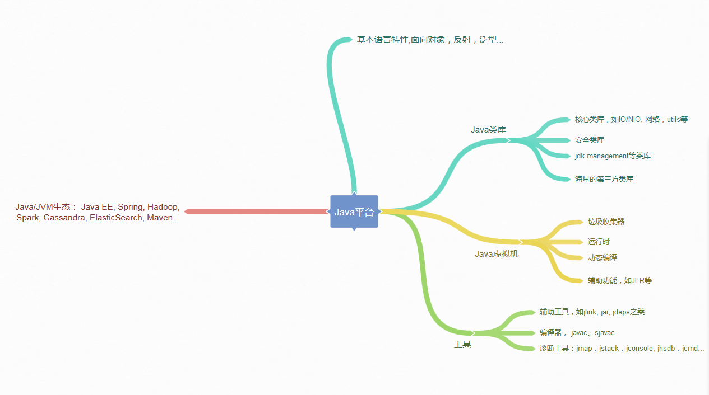

# 极客时间 - Java核心技术面试精讲

杨晓峰

前Oracle首席工程师

# 开篇词 | 以面试题为切入点，有效提升你的Java内功

Java 高级工程师或者技术专家，则往往全面考察 Java IO/NIO、并发、虚拟机等，不仅仅是了解，更要求对底层源代码层面的掌握，并对分布式、安全、性能等领域能力有进一步的要求。

# 第1讲 | 谈谈你对Java平台的理解？

## 问题

谈谈你对 Java 平台的理解？“Java 是解释执行”，这句话正确吗？

JRE，也就是 Java 运行环境，包含了 JVM 和 Java 类库，以及一些模块等。

JDK 可以看作是 JRE 的一个超集，提供了更多工具，比如编译器、各种诊断工具等。

开发的 Java 的源代码，首先通过 Javac 编译成为字节码（bytecode），然后，在运行时，通过 Java 虚拟机（JVM）内嵌的解释器将字节码转换成为最终的机器码。但是常见的 JVM，比如我们大多数情况使用的 Oracle JDK 提供的 Hotspot JVM，都提供了 **JIT（Just-In-Time）编译器**，也就是通常所说的动态编译器，**JIT 能够在运行时将热点代码编译成机器码，这种情况下部分热点代码就属于编译执行，而不是解释执行了。**

Javac 的编译，编译 Java 源码生成“.class”文件里面实际是字节码，而不是可以直接执行的机器码。Java 通过字节码和 Java 虚拟机（JVM）这种跨平台的抽象，屏蔽了操作系统和硬件的细节，这也是实现“一次编译，到处执行”的基础。

JVM 会通过类加载器（Class-Loader）加载字节码，解释或者编译执行。就像我前面提到的，主流 Java 版本中，如 JDK 8 实际是解释和编译混合的一种模式，即所谓的混合模式（-Xmixed）。

Oracle Hotspot JVM 内置了两个不同的 JIT compiler，C1 对应前面说的 client 模式，适用于对于启动速度敏感的应用，比如普通 Java 桌面应用；C2 对应 server 模式，它的优化是为长时间运行的服务器端应用设计的。默认是采用所谓的分层编译（TieredCompilation）。

# 第2讲 | Exception和Error有什么区别？

Exception 和 Error 都是继承了 Throwable 类，在 Java 中只有 Throwable 类型的实例才可以被抛出（throw）或者捕获（catch），它是异常处理机制的基本组成类型。

Exception 是程序正常运行中，可以预料的意外情况，可能并且应该被捕获，进行相应处理。

Error 是指在正常情况下，不大可能出现的情况，绝大部分的 Error 都会导致程序（比如 JVM 自身）处于非正常的、不可恢复状态。既然是非正常情况，所以不便于也不需要捕获，常见的比如 OutOfMemoryError 之类，都是 Error 的子类。

Exception 又分为可检查（checked）异常和不检查（unchecked）异常.

可检查异常在源代码里必须显式地进行捕获处理，这是编译期检查的一部分。

不检查异常就是所谓的运行时异常，类似 NullPointerException、ArrayIndexOutOfBoundsException 之类，通常是可以编码避免的逻辑错误，具体根据需要来判断是否需要捕获，并不会在编译期强制要求。

异常处理的两个基本原则

第一，尽量不要捕获类似 Exception 这样的通用异常，而是应该捕获特定异常。

第二，不要生吞（swallow）异常。

**Throw early, catch late 原则**

反应式编程（Reactive Stream），因为其本身是异步、基于事件机制的，所以出现异常情况，决不能简单抛出去

# 第3讲 | 谈谈final、finally、 finalize有什么不同？

# 推荐书籍

周志明《深入理解 Java 虚拟机》

