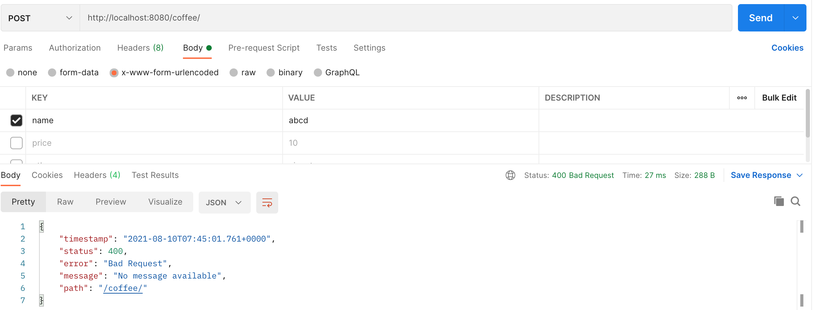
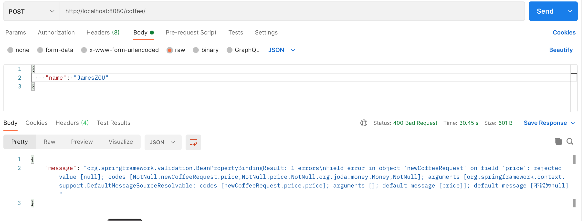
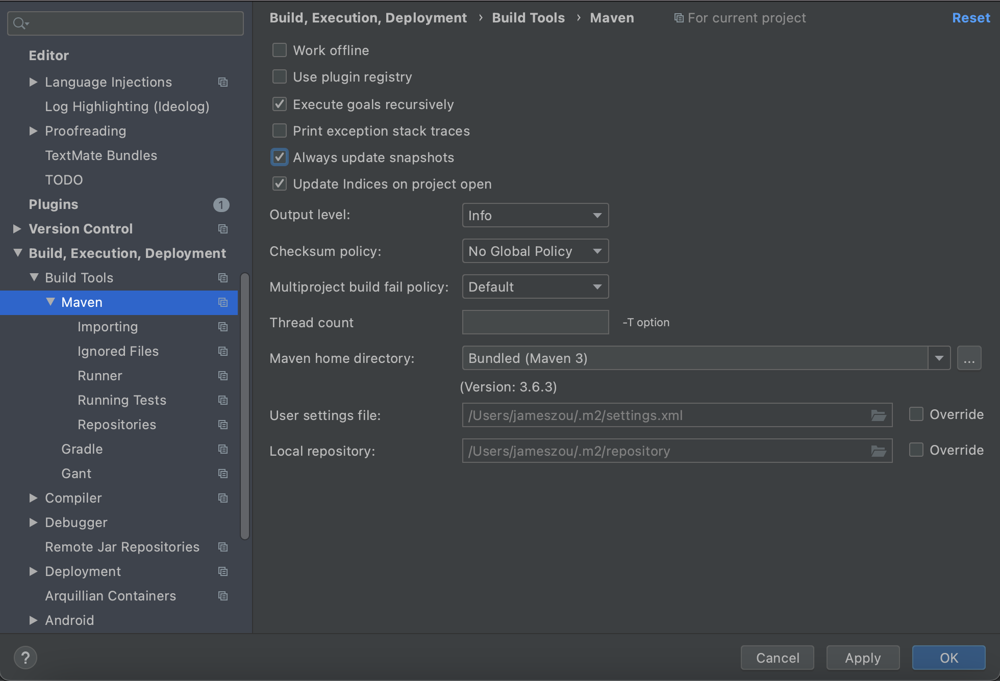
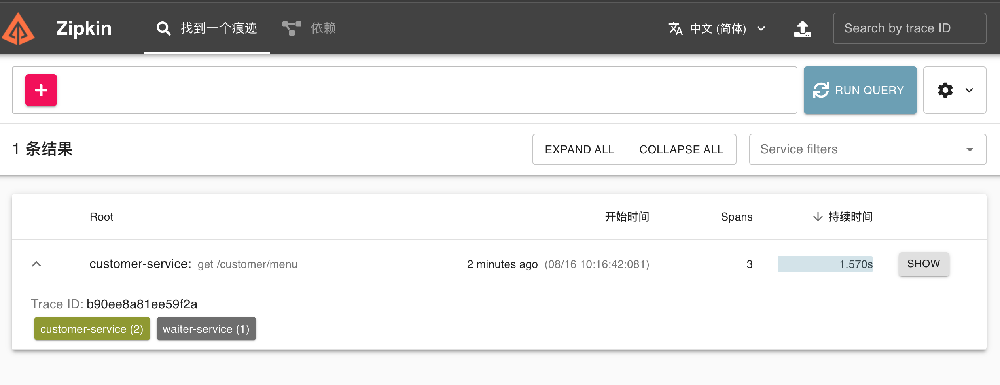
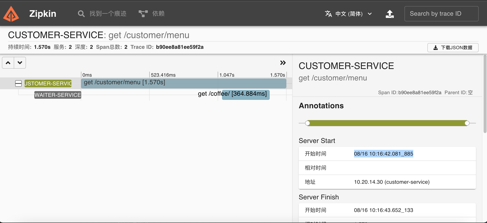
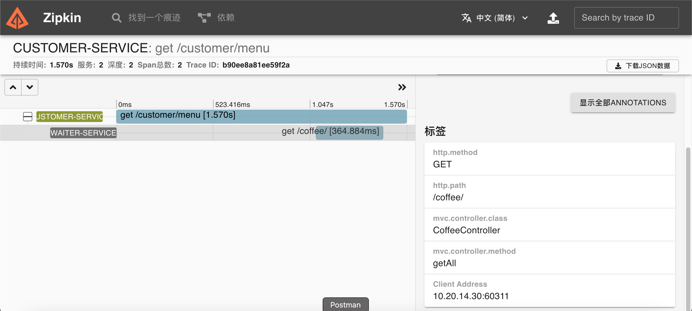

# 玩转Spring全家桶

[极客时间](https://time.geekbang.org)视频课程《玩转Spring全家桶》课程课件及代码示例。

# 第一章: 初识 Spring

## macos动态切换java版本

在macOS中安装jdk，并查看是否安装成功

```shell
jameszou@JamesZOUdeMacBook-Pro target % /usr/libexec/java_home -V
Matching Java Virtual Machines (2):
    11.0.7 (x86_64) "Oracle Corporation" - "Java SE 11.0.7" /Library/Java/JavaVirtualMachines/jdk-11.0.7.jdk/Contents/Home
    1.8.0_251 (x86_64) "Oracle Corporation" - "Java SE 8" /Library/Java/JavaVirtualMachines/jdk1.8.0_251.jdk/Contents/Home
/Library/Java/JavaVirtualMachines/jdk-11.0.7.jdk/Contents/Home
```

打开根目录下的隐藏文件.bash_profile进行环境配置

打开 .bash_profile，没有的话创建

```
vim ~/.bash_profile
```

写入以下内容

```shell
export JAVA_8_HOME=/Library/Java/JavaVirtualMachines/jdk1.8.0_251.jdk/Contents/Home
export JAVA_11_HOME=/Library/Java/JavaVirtualMachines/jdk-11.0.7.jdk/Contents/Home
alias jdk8="export JAVA_HOME=$JAVA_8_HOME" #编辑一个命令jdk8，输入则转至jdk1.8
alias jdk11="export JAVA_HOME=$JAVA_11_HOME" #编辑一个命令jdk11，输入则转至jdk1.11
export JAVA_HOME=`/usr/libexec/java_home`  #最后安装的版本，这样当自动更新时，始终指向最新版本
```

执行命令生效

```shell
source ~/.bash_profil
```

使用jdk？实现终端命令的自由切换

```shell
jameszou@JamesZOUdeMacBook-Pro helloworld % jdk11
jameszou@JamesZOUdeMacBook-Pro helloworld % java -version
java version "11.0.7" 2020-04-14 LTS
Java(TM) SE Runtime Environment 18.9 (build 11.0.7+8-LTS)
Java HotSpot(TM) 64-Bit Server VM 18.9 (build 11.0.7+8-LTS, mixed mode)

jameszou@JamesZOUdeMacBook-Pro helloworld % jdk8
jameszou@JamesZOUdeMacBook-Pro helloworld % java -version
java version "1.8.0_251"
Java(TM) SE Runtime Environment (build 1.8.0_251-b08)
Java HotSpot(TM) 64-Bit Server VM (build 25.251-b08, mixed mode)
```

## 生成骨架

[Spring Initializr](https://start.spring.io/)

## 访问

[localhost:8080/hello](http://localhost:8080/hello)

[localhost:8080/actuator/health](http://localhost:8080/actuator/health)

[localhost:8080/actuator/beans](http://localhost:8080/actuator/beans)

## 编译

```shell
mvn clean package -Dmaven.test.skip
```

编译之后在target目录生成文件

helloworld-0.0.1-SNAPSHOT.jar

```shell
jameszou@JamesZOUdeMacBook-Pro target % ls -al
total 37096
drwxr-xr-x   8 jameszou  staff       256  5 17 09:54 .
drwxr-xr-x@ 14 jameszou  staff       448  5 17 09:54 ..
drwxr-xr-x   4 jameszou  staff       128  5 17 09:54 classes
drwxr-xr-x   3 jameszou  staff        96  5 17 09:54 generated-sources
-rw-r--r--   1 jameszou  staff  18985235  5 17 09:54 helloworld-0.0.1-SNAPSHOT.jar
-rw-r--r--   1 jameszou  staff      3053  5 17 09:54 helloworld-0.0.1-SNAPSHOT.jar.original
drwxr-xr-x   3 jameszou  staff        96  5 17 09:54 maven-archiver
drwxr-xr-x   3 jameszou  staff        96  5 17 09:54 maven-status
```

## 执行

停止ide中运行的进程

```
java -jar helloworld-0.0.1-SNAPSHOT.jar
```

# 第2章: Spring中的数据操作

## H2 Database 简介

H2 是一个使用 Java 编写的数据库，支持内存、文件等多种模式，经常用于项目的测试环境。除此之外，通过 H2 的官网了解到，H2 还提供了丰富的特性。

H2的优势：

1、h2采用纯Java编写，因此不受平台的限制。
2、h2只有一个jar文件，十分适合作为嵌入式数据库试用。
3、h2提供了一个十分方便的web控制台用于操作和管理数据库内容。

在 H2 应用方面，可以应用在如下场景：

1. H2 可以作为嵌入式数据库，数据库读性能要优于 SQLite，H2 官方提供的一个建议：可以在需要时使用时替换 SQLite。
2. 此外由于 H2 支持内存模式，因此在进行单元测试的时候非常适合内存数据库。
3. 另外由于 H2 文件体积非常小，安装、启动非常简单，且支持全文检索等高级特性，因此在一些简单场景下使用 H2 也能够快速建立起应用。

数据访问

打开浏览器，输入地址：http://localhost:8082访问H2数据库的Web Console

## Demo1 - datasource

### org.springframework.boot.CommandLineRunner

在应用服务启动时，需要在所有Bean生成之后，加载一些数据和执行一些应用的初始化。例如：删除临时文件，清楚缓存信息，读取配置文件，数据库连接，这些工作类似开机自启动的概念，CommandLineRunner、ApplicationRunner 接口是在容器启动成功后的最后一步回调（类似开机自启动）。


### org.springframework.boot.ApplicationRunner

ApplicationRunner接口源码定义如下：

```java
package org.springframework.boot;

import org.springframework.core.Ordered;
import org.springframework.core.annotation.Order;

/**
 * Interface used to indicate that a bean should <em>run</em> when it is contained within
 * a {@link SpringApplication}. Multiple {@link ApplicationRunner} beans can be defined
 * within the same application context and can be ordered using the {@link Ordered}
 * interface or {@link Order @Order} annotation.
 *
 * @author Phillip Webb
 * @since 1.3.0
 * @see CommandLineRunner
 */
@FunctionalInterface
public interface ApplicationRunner {

   /**
    * Callback used to run the bean.
    * @param args incoming application arguments
    * @throws Exception on error
    */
   void run(ApplicationArguments args) throws Exception;

}
```

在对该接口的注释中，可以看到两个接口的应用场景，甚至注释都是完全一样的。唯一的区别是接口中的函数run的参数，一个是与main函数同样的(String[] args)，而另外一个是ApplicationArgumens类型。在一般情况下，开发时是不需要添加命令行参数的，因此两个接口的区别对于这样的场景也就完全一样了。但如果真的需要类型–foo=bar的option arguments，为了方便起见，可以使用ApplicationRunner来读取类似的参数。

### CommandLineRunner和ApplicationRunner区别

从上面的分析可以看出，CommandLineRunner和ApplicationRunner接口的作用是完全一致的，唯一不同的则是接口中待实现的run方法，其中CommandLineRunner的run方法参数类型与main一样是原生的String[] 类型，而ApplicationRunner的run方法参数类型为ApplicationArguments类型。

### JamesZOU学习体会


## demo2 - pure-spring-datasource

不使用spring boot的配置

### JamesZOU学习体会

## demo3 - multi-datasource

配置多个数据源

```java
@SpringBootApplication(exclude = { DataSourceAutoConfiguration.class,
        DataSourceTransactionManagerAutoConfiguration.class,
        JdbcTemplateAutoConfiguration.class})
```


通过

[localhost:8080/actuator/beans](http://localhost:8080/actuator/beans)

进行查看

###  JamesZOU学习体会

## demo4 - druid

阿里巴巴的druid数据库连接池

pom.xml

```xml
<dependency>
  <groupId>org.springframework.boot</groupId>
  <artifactId>spring-boot-starter-jdbc</artifactId>
  <exclusions>
    <exclusion>
      <artifactId>HikariCP</artifactId>
      <groupId>com.zaxxer</groupId>
    </exclusion>
  </exclusions>
</dependency>

<dependency>
  <groupId>com.alibaba</groupId>
  <artifactId>druid-spring-boot-starter</artifactId>
  <version>1.1.10</version>
</dependency>
```

druid-filter.properties

ConnectionLogFilter.java

### JamesZOU学习体会

## demo 5 - simple jdbc

spring jdbc简单操作

### JamesZOU学习体会

## demo 6 - programmatic-transaction

编程式事务

JTA(Java Transaction Manager) 

JTA是如何实现多数据源的事务管理呢?

主要的原理是**两阶段提交**

### JamesZOU学习体会


## demo 7 - declarative-transaction

声明式事务

```xml
		<dependency>
			<groupId>org.springframework.boot</groupId>
			<artifactId>spring-boot-starter-aop</artifactId>
		</dependency>
		<dependency>
			<groupId>org.springframework</groupId>
			<artifactId>spring-aspects</artifactId>
		</dependency>
		
```

### JamesZOU学习体会


## demo 8 - errorcode

spring的jdbc异常抽象

### JamesZOU学习体会

# 第3章: ORM

## demo 1 - jpa demo


## demo 2 - jpa complex demo

repository中的这些方法在哪定义呢?

## demo 3 - mybatis-demo

MoneyTypeHandler什么时候会用到

## demo 4 - mybatis-generator-demo

pom.xml

```xml
<dependency>
  <groupId>org.mybatis.generator</groupId>
  <artifactId>mybatis-generator-core</artifactId>
  <version>1.3.7</version>
</dependency>
```


配置

```
src/main/resource/generatorConfig.xml
```

自动生成的有

```
src/main/java/geektime/spring/data/mybatis/mapper
src/main/java/geektime/spring/data/mybatis/model
src/main/resource/mapper
```

## demo 5 - mybatis-pagehelper-demo

## demo 6 - springbucks

# 第4章: NoSQL实践

## demo 1 - mongo-demo

## demo 2 - mongo-repository-demo

pom.xml

```xml
		<dependency>
			<groupId>org.springframework.boot</groupId>
			<artifactId>spring-boot-starter-data-mongodb</artifactId>
		</dependency>
```

## demo 3 - jedis-demo

## demo 4 - cache-demo


## demo 5 - cache-with-redis-demo

pom.xml

```xml
		<dependency>
			<groupId>org.springframework.boot</groupId>
			<artifactId>spring-boot-starter-cache</artifactId>
		</dependency>
		<dependency>
			<groupId>org.springframework.boot</groupId>
			<artifactId>spring-boot-starter-data-redis</artifactId>
		</dependency>
```


## demo 6 - redis-demo

## demo 7 - redis-repository-demo

# 第5章: 数据访问进阶

## demo 1 - simple-reactor-demo

## demo 2 - redis-demo

pom.xml

```xml
		<dependency>
			<groupId>org.springframework.boot</groupId>
			<artifactId>spring-boot-starter-data-redis-reactive</artifactId>
		</dependency>
```

## demo 3 - mongodb-demo

pom.xml

```xml
		<dependency>
			<groupId>org.springframework.boot</groupId>
			<artifactId>spring-boot-starter-data-mongodb-reactive</artifactId>
		</dependency>
```

## demo 4 - simple-r2dbc-demo

spring Milestone的依赖不在主仓库里

```xml
	<repositories>
		<repository>
			<id>spring-milestone</id>
			<name>Spring Maven MILESTONE Repository</name>
			<url>http://repo.spring.io/libs-milestone</url>
		</repository>
	</repositories>
```

## demo 5 - r2dbc-repository-demo

## demo 6 - performance-aspect-demo

p6spy


## demo 7 - reactive-springbucks

# 第6章: Web哪些事

## demo 1 - simple-controller-demo

idea中有rest插件

## demo 2 - context-hierarchy-demo

spring的应用程序上下文

### 演示1: 

applicationContext.xml

```xml
<!-- <aop:aspectj-autoproxy/> -->

<bean id="testBeanX" class="geektime.spring.web.context.TestBean">
  <constructor-arg name="context" value="Bar" />
</bean>

<!-- <bean id="fooAspect" class="geektime.spring.web.foo.FooAspect" /> -->
```

FooConfig.java

```java
@Bean
public FooAspect fooAspect() {
  return new FooAspect();
}
```

输出

```
: hello foo
: after hello()
: =====================================
: hello Bar
: =====================================
: hello foo
: after hello()
```

### 演示2: 

applicationContext.xml

```xml
<!-- <aop:aspectj-autoproxy/> -->

<bean id="testBeanX" class="geektime.spring.web.context.TestBean">
  <constructor-arg name="context" value="Bar" />
</bean>

<!-- <bean id="fooAspect" class="geektime.spring.web.foo.FooAspect" /> -->
```

FooConfig.java

```java
//    @Bean
//    public FooAspect fooAspect() {
//        return new FooAspect();
//    }
```

输出

```
: hello foo
: =====================================
: hello Bar
: =====================================
: hello foo
```

### 演示3: 

applicationContext.xml

```xml
<aop:aspectj-autoproxy/>

<bean id="testBeanX" class="geektime.spring.web.context.TestBean">
  <constructor-arg name="context" value="Bar" />
</bean>

<bean id="fooAspect" class="geektime.spring.web.foo.FooAspect" />
```

FooConfig.java

```java
//    @Bean
//    public FooAspect fooAspect() {
//        return new FooAspect();
//    }
```

输出

```
: hello foo
: after hello()
: =====================================
: hello Bar
: after hello()
: =====================================
: hello foo
: after hello()
```

### 演示4:

applicationContext.xml

```xml
<aop:aspectj-autoproxy/>

<bean id="testBeanX" class="geektime.spring.web.context.TestBean">
  <constructor-arg name="context" value="Bar" />
</bean>

<!-- <bean id="fooAspect" class="geektime.spring.web.foo.FooAspect" /> -->
```

FooConfig.java

```java
    @Bean
    public FooAspect fooAspect() {
        return new FooAspect();
    }
```

输出

```
: hello foo
: =====================================
: hello Bar
: after hello()
: =====================================
: hello foo
```

### 


## demo 3 - complex-controller-demo

## demo 4 - more-complex-controller-demo

```java
    @PostMapping(path = "/", consumes = MediaType.MULTIPART_FORM_DATA_VALUE)
    @ResponseBody
    @ResponseStatus(HttpStatus.CREATED)
    public List<Coffee> batchAddCoffee(@RequestParam("file") MultipartFile file) {
    	...
    }
```

上传文件

使用postman,  body -> form-data -> 填入key -> 选择文件


## demo 5 - json-view-demo

```xml
		<!-- 增加Jackson的Hibernate类型支持 -->
		<dependency>
			<groupId>com.fasterxml.jackson.datatype</groupId>
			<artifactId>jackson-datatype-hibernate5</artifactId>
			<version>2.9.8</version>
		</dependency>
		<!-- 增加Jackson XML支持 -->
		<dependency>
			<groupId>com.fasterxml.jackson.dataformat</groupId>
			<artifactId>jackson-dataformat-xml</artifactId>
			<version>2.9.0</version>
		</dependency>
```

```java
@PostMapping(path = "/", consumes = MediaType.APPLICATION_JSON_UTF8_VALUE)
```

序列化

```java
@JsonComponent
```


## demo 6 - thymeleaf-view-demo

模版引擎

CoffeeOrderController.java

```java
    @GetMapping(path = "/")
    public ModelAndView showCreateForm() {
        return new ModelAndView("create-order-form");
    }
```


## demo 7 - cache-demo

静态资源与缓存

不提倡使用这种方式

启动, 然后使用postman来做静态资源的请求

```html
http://localhost:8080/static/spring.png
```

然后查看里面的headers，查看cache-control


在查看 CoffeeController.java, 手动设置

```java
@RequestMapping(path = "/{id}", method = RequestMethod.GET,
                produces = MediaType.APPLICATION_JSON_UTF8_VALUE)
@ResponseBody
public ResponseEntity<Coffee> getById(@PathVariable Long id) {
  Coffee coffee = coffeeService.getCoffee(id);
  return ResponseEntity.ok()
    .cacheControl(CacheControl.maxAge(10, TimeUnit.SECONDS))
    .body(coffee);
}
```


## demo 8 - exception-demo

异常处理

定义异常 FormValidationException.java

抛出异常 CoffeeController.java

```java
    @PostMapping(path = "/", consumes = MediaType.APPLICATION_FORM_URLENCODED_VALUE)
    @ResponseBody
    @ResponseStatus(HttpStatus.CREATED)
    public Coffee addCoffee(@Valid NewCoffeeRequest newCoffee,
                            BindingResult result) {
        if (result.hasErrors()) {
            log.warn("Binding Errors: {}", result);
            throw new FormValidationException(result);
        }
        return coffeeService.saveCoffee(newCoffee.getName(), newCoffee.getPrice());
    }

    @PostMapping(path = "/", consumes = MediaType.APPLICATION_JSON_UTF8_VALUE)
    @ResponseBody
    @ResponseStatus(HttpStatus.CREATED)
    public Coffee addJsonCoffee(@Valid @RequestBody NewCoffeeRequest newCoffee,
                                BindingResult result) {
        if (result.hasErrors()) {
            log.warn("Binding Errors: {}", result);
            throw new ValidationException(result.toString());
        }
        return coffeeService.saveCoffee(newCoffee.getName(), newCoffee.getPrice());
    }
```

异常切面GlobalControllerAdvice.java

```java
@RestControllerAdvice
public class GlobalControllerAdvice {
    @ExceptionHandler(ValidationException.class)
    @ResponseStatus(HttpStatus.BAD_REQUEST)
    public Map<String, String> validationExceptionHandler(ValidationException exception) {
        Map<String, String> map = new HashMap<>();
        map.put("message", exception.getMessage());
        return map;
    }
}
```

使用postman模拟截取到切面异常






## demo 9 - springbucks

切入点/拦截器

import org.springframework.web.servlet.config.annotation.WebMvcConfigurer;

PerformanceInteceptor.java


# 第7章: 访问web资源

## demo 1 - simple-resttemplate-demo

RestTemplate

## demo 2 - complex-resttemplate-demo

RestTemplate高阶用法

## demo 3 - advanced-resttemplate-demo

简单定制RestTemplate

## demo 4 - webclient-demo

通过WebClient访问web资源

## demo 5 - customer-service

# 第8章: Web开发进阶

## demo 1 - hateoas-waiter-service

```
  "_links" : {
    "self" : {
      "href" : "http://localhost:8080/coffee{?page,size,sort}",
      "templated" : true
    },
    "profile" : {
      "href" : "http://localhost:8080/profile/coffee"
    },
    "search" : {
      "href" : "http://localhost:8080/coffee/search"
    }
  },
```

## demo2:  hateoas-customer-service

需要首先启动 demo1: hateoas-waiter-service

插入 coffee 和 coffeeOrder

仔细查看代码 CustomerRunner.java

如何执行 CustomerRunner 的代码呢? 对代码进行修改，然后debug

```java
public class CustomerServiceApplication extends CustomerRunner{
  ...
}
```


## demo3: session-demo 

```java
@SpringBootApplication
@RestController
@EnableRedisHttpSession
public class SessionDemoApplication {

	public static void main(String[] args) {
		SpringApplication.run(SessionDemoApplication.class, args);
	}

	@RequestMapping("/hello")
	public String printSession(HttpSession session, String name) {
		String storedName = (String) session.getAttribute("name");
		if (storedName == null) {
			session.setAttribute("name", name);
			storedName = name;
		}
		return "hello " + storedName;
	}

}
```

chrome中发起get请求

```
http://localhost:8080/hello?name=jameszou
```

去redis中查看数据

```shell
 % redis-cli
 
127.0.0.1:6379> keys *
 4) "spring:session:expirations:1628648160000"
 8) "spring:session:sessions:expires:20af3d22-bbbd-4ea1-bfa1-cfeaf3034c63"
17) "spring:session:sessions:20af3d22-bbbd-4ea1-bfa1-cfeaf3034c63"
127.0.0.1:6379> type spring:session:sessions:20af3d22-bbbd-4ea1-bfa1-cfeaf3034c63
hash

127.0.0.1:6379> HGETALL spring:session:sessions:20af3d22-bbbd-4ea1-bfa1-cfeaf3034c63
1) "sessionAttr:name"
2) "\xac\xed\x00\x05t\x00\bjameszou"
3) "creationTime"
4) "\xac\xed\x00\x05sr\x00\x0ejava.lang.Long;\x8b\xe4\x90\xcc\x8f#\xdf\x02\x00\x01J\x00\x05valuexr\x00\x10java.lang.Number\x86\xac\x95\x1d\x0b\x94\xe0\x8b\x02\x00\x00xp\x00\x00\x01{2\xe0F\xec"
5) "maxInactiveInterval"
6) "\xac\xed\x00\x05sr\x00\x11java.lang.Integer\x12\xe2\xa0\xa4\xf7\x81\x878\x02\x00\x01I\x00\x05valuexr\x00\x10java.lang.Number\x86\xac\x95\x1d\x0b\x94\xe0\x8b\x02\x00\x00xp\x00\x00\a\b"
7) "lastAccessedTime"
8) "\xac\xed\x00\x05sr\x00\x0ejava.lang.Long;\x8b\xe4\x90\xcc\x8f#\xdf\x02\x00\x01J\x00\x05valuexr\x00\x10java.lang.Number\x86\xac\x95\x1d\x0b\x94\xe0\x8b\x02\x00\x00xp\x00\x00\x01{2\xe2\xa4w"
```

再次向chrome中发起get请求

```shell
http://localhost:8080/hello?name=james
# 这个时候由于缓存的关系, 得到的结果还是
# hello jameszou
```

重启程序, 演示单机情况下缓存失效，因为现在是基于redis的集中session, 所以这里还是会保留缓存


## demo4: webflux-waiter-service


R2JDBC

Mono

Flux 

示例没有启动起来, 忽略

# 第9章: 重新认识spring boot

## demo1: autoconfigure-demo

pom.xml

```xml
		<!-- 以下是基于Spring Boot的自动配置 -->
		<dependency>
			<groupId>geektime.spring.hello</groupId>
			<artifactId>geektime-spring-boot-autoconfigure</artifactId>
			<version>0.0.1-SNAPSHOT</version>
		</dependency>

		<dependency>
			<groupId>geektime.spring.hello</groupId>
			<artifactId>greeting</artifactId>
			<version>0.0.1-SNAPSHOT</version>
		</dependency>
```

通过 File -> New -> Module from Existing Source -> 将这2个模块对应的pom.xml导入进来

## demo2: geektime-autoconfigure-backport

## demo3: geektime-spring-boot-starter

定制自己的起步依赖


# 第10章: 运行中的spring boot

JMX访问可以使用JDK自带的JConsole 或 JVisualVM

## demo1: indicator-demo

动⼿定制⾃己的 Health Indicator

support/CoffeeIndicator.java

```java
@Component
public class CoffeeIndicator implements HealthIndicator {
    @Autowired
    private CoffeeService coffeeService;

    @Override
    public Health health() {
    	...
    }
}
```

访问

```
http://localhost:8080/actuator/health
http://localhost:8080/actuator/health/coffeeIndicator
```

结果

```json
{
    "status": "UP",
    "details": {
        "count": 5,
        "message": "We have enough coffee."
    }
}
```

application.properties中定义info

```
info.app.author=DigitalSonic
info.app.encoding=@project.build.sourceEncoding@
```

访问info

http://localhost:8080/actuator/info

结果

```json
{
    "app": {
        "author": "DigitalSonic",
        "encoding": "UTF-8"
    }
}
```


## demo2: metrics-demo

自定义度量指标

service/CoffeeOrderService.java

```java
import io.micrometer.core.instrument.Counter;
import io.micrometer.core.instrument.MeterRegistry;
import io.micrometer.core.instrument.binder.MeterBinder;

@Service
@Transactional
@Slf4j
public class CoffeeOrderService implements MeterBinder {
    @Override
    public void bindTo(MeterRegistry meterRegistry) {
      	// 每次对订单总数+1
        this.orderCounter = meterRegistry.counter("order.count");
    }
}
```

运行, 访问

```
http://localhost:8080/actuator/metrics
```

在里面能搜索到order.count指标

```json
{
	"names": [
    "order.count",
  ]
}
```

访问

```
http://localhost:8080/actuator/metrics/order.count
```

结果

```json
{
    "name": "order.count",
    "description": null,
    "baseUnit": null,
    "measurements": [
        {
        "statistic": "COUNT",
        "value": 0
        }
    ],
    "availableTags": []
}
```

访问prometheus

```
http://localhost:8080/actuator/prometheus
```

得到值, 可以看到值进行了一些转换

```properties
# HELP order_count_total  
# TYPE order_count_total counter
order_count_total 0.0
```

使用postman新增订单

```
POST http://localhost:8080/order/
{
    "customer": "JamesZOU",
    "items": ["espresso", "mocha", "capuccino"]
}
```

再重新去看, 会发现相关数字增加了

## demo3: sba-server-demo & sba-client-demo

Spring Boot Admin

通过 Spring Boot Admin 了解程序的运⾏状态

非官方, 第三方提供

sba-client-demo使用8081端口

运行sba-server-demo, 访问

```
http://localhost:8080
http://localhost:8080/login
```

运行 sba-client-demo, 访问

```
http://localhost:8081
http://localhost:8081/login
```


## demo4:  tomcat-demo

定制 Web 容器器的运⾏参数

application.properties中设置

WaiterServiceApplication.java中通过编程方式设置

访问

```shell
# 设置压缩方式
curl -H "Accept-Encoding: gzip" -v http://localhost:8080/coffee/1
```

## demo5: command-line-demo

application.propeties

```properties
spring.main.web-application-type=none
```

FooCommandLineRunner.java这个类有什么作用呢?

```java
@Component
@Order(1)
@Slf4j
public class FooCommandLineRunner implements CommandLineRunner {
    @Override
    public void run(String... args) throws Exception {
        log.info("Foo");
    }
}
```

## demo6: jar-demo

maven打包

```shell
mvn clean package -Dmaven.test.skip=true
```


pom.xml

```xml
	<build>
		<plugins>
			<plugin>
				<groupId>org.springframework.boot</groupId>
				<artifactId>spring-boot-maven-plugin</artifactId>
				<configuration>
					<executable>true</executable>
				</configuration>
			</plugin>
		</plugins>
	</build>
```

waiter-service.conf, 与jar包同名, 处于同一个目录, 会自动识别

```properties
JAVA_OPTS="-Xmx1024m -Xms1024m -Xmn384m"
```

打开另外一个程序, 通过命令查看是否使用了waiter-service.conf中指定的参数

```
ps aux | grep java
```


## demo7: docker-demo

Pom.xml

```xml
	<build>
		<plugins>
			<plugin>
				<groupId>com.spotify</groupId>
				<artifactId>dockerfile-maven-plugin</artifactId>
				<version>1.4.10</version>
				<executions>
					<execution>
						<id>default</id>
						<goals>
							<goal>build</goal>
							<goal>push</goal>
						</goals>
					</execution>
				</executions>
				<configuration>
					<repository>${docker.image.prefix}/${project.artifactId}</repository>
					<tag>${project.version}</tag>
					<buildArgs>
						<JAR_FILE>${project.build.finalName}.jar</JAR_FILE>
					</buildArgs>
				</configuration>
			</plugin>
		</plugins>
	</build>
```

Dockerfile

```shell
FROM java:8
EXPOSE 8080
# 对应pom.xml文件中的
# <JAR_FILE>${project.build.finalName}.jar</JAR_FILE>
ARG JAR_FILE
ADD target/${JAR_FILE} /waiter-service.jar
ENTRYPOINT ["java", "-jar","/waiter-service.jar"]
```


依次执行如下命令

```shell
# jdk必须使用8, 使用11打包通不过
mvn clean package -Dmaven.test.skip
# 或者使用
mvn package
mvn dockerfile:build

# 执行命令会找到 springbucks/waiter-server
docker images
# REPOSITORY                     TAG              IMAGE ID       CREATED         SIZE
# springbucks/docker-demo        0.0.1-SNAPSHOT   eae7a9fa3379   3 minutes ago   683MB

# 执行镜像
docker run --name docker-demo -d -p 8080:8080 springbucks/docker-demo:0.0.1-SNAPSHOT

# 观察日志
docker logs
docker ps

# 测试
curl http://localhost:8080/coffee/1

# 推到仓库中去
docker deploy xxx
```


# 第11章: Spring Cloud云原生应用

# 第12章: 服务发现与注册

## demo1: eureka-server eureka-waiter-service

eureka	美  [juˈriːkə]	int. 我发现了，我找到了

eureka针对aws研发, 并且2.0开始也不开源了。如果不是在aws上，不建议使用

### eureka-server

pom.xml

```xml
	<dependencies>
		<dependency>
			<groupId>org.springframework.cloud</groupId>
			<artifactId>spring-cloud-starter-netflix-eureka-server</artifactId>
		</dependency>
	</dependencies>
	<dependencyManagement>
		<dependencies>
			<dependency>
				<groupId>org.springframework.cloud</groupId>
				<artifactId>spring-cloud-dependencies</artifactId>
				<version>${spring-cloud.version}</version>
				<type>pom</type>
				<scope>import</scope>
			</dependency>
		</dependencies>
	</dependencyManagement>
```

application.properties

```properties
server.port=8761
# 自己不向eureka注册
eureka.client.register-with-eureka=false
eureka.client.fetch-registry=false
```

EurekaServerApplication.java

```java
import org.springframework.cloud.netflix.eureka.server.EnableEurekaServer;

@SpringBootApplication
@EnableEurekaServer
public class EurekaServerApplication {

	public static void main(String[] args) {
		SpringApplication.run(EurekaServerApplication.class, args);
	}

}
```

启动服务，注意这里一定要使用jdk8

访问

```
http://localhost:8761/
```


### eureka-waiter-service

pom.xml

```xml
	<dependencies>
		<dependency>
			<groupId>org.springframework.cloud</groupId>
			<artifactId>spring-cloud-starter-netflix-eureka-client</artifactId>
		</dependency>
	</dependencies>
	<dependencyManagement>
		<dependencies>
			<dependency>
				<groupId>org.springframework.cloud</groupId>
				<artifactId>spring-cloud-dependencies</artifactId>
				<version>${spring-cloud.version}</version>
				<type>pom</type>
				<scope>import</scope>
			</dependency>
		</dependencies>
	</dependencyManagement>
```

application.properties

```properties
# 随机自动选择端口
server.port=0
```

bootstrap.properties

```
spring.application.name=waiter-service
```

WaiterServiceApplication.java

```java
import org.springframework.cloud.client.discovery.EnableDiscoveryClient;

@EnableDiscoveryClient
public class WaiterServiceApplication implements WebMvcConfigurer {
	...
}
```

启动, 注意这里也需要使用jdk8, 然后登录eureka的网站去访问, 去查看

```
http://localhost:8761/
```

## demo2: ribbon-customer-service

前提是需要执行demo1

CustomerServiceApplication.java

```java
import org.springframework.cloud.client.loadbalancer.LoadBalanced;

public class CustomerServiceApplication {
	@LoadBalanced
	@Bean
	public RestTemplate restTemplate(RestTemplateBuilder builder) {
		return builder
				.setConnectTimeout(Duration.ofMillis(100))
				.setReadTimeout(Duration.ofMillis(500))
				.requestFactory(this::requestFactory)
				.build();
	}
}
```

CustomerRunner.java

```java
public class CustomerRunner implements ApplicationRunner {
    private void showServiceInstances() {
        log.info("DiscoveryClient: {}", discoveryClient.getClass().getName());
        discoveryClient.getInstances("waiter-service").forEach(s -> {
            log.info("Host: {}, Port: {}", s.getHost(), s.getPort());
        });
    }
}
```

运行, 能看到打印出了关于waiter-service的信息

同时登录eureka界面, 发现自己也注册到了eureka

## demo3: feign-customer-service

pom.xml

```xml
		<dependency>
			<groupId>org.springframework.cloud</groupId>
			<artifactId>spring-cloud-starter-openfeign</artifactId>
		</dependency>
		<dependency>
			<groupId>io.github.openfeign</groupId>
			<artifactId>feign-httpclient</artifactId>
		</dependency>
```

application.properties

```properties
feign.client.config.default.connect-timeout=500
feign.client.config.default.read-timeout=500
```

CustomerServiceApplication.java

```java
import org.springframework.cloud.openfeign.EnableFeignClients;

@SpringBootApplication
@Slf4j
@EnableDiscoveryClient
@EnableFeignClients
public class CustomerServiceApplication {
	...
}
```

integration/CoffeeService.java

```java
import org.springframework.cloud.openfeign.FeignClient;

@FeignClient(name = "waiter-service", contextId = "coffee", path = "/coffee")
// 不要在接口上加@RequestMapping
public interface CoffeeService {
    @GetMapping(path = "/", params = "!name")
    List<Coffee> getAll();

    @GetMapping("/{id}")
    Coffee getById(@PathVariable Long id);

    @GetMapping(path = "/", params = "name")
    Coffee getByName(@RequestParam String name);
}
```


integration/CoffeeOrderService.java

```java
import org.springframework.cloud.openfeign.FeignClient;

@FeignClient(name = "waiter-service", contextId = "coffeeOrder")
public interface CoffeeOrderService {
    @GetMapping("/order/{id}")
    CoffeeOrder getOrder(@PathVariable("id") Long id);

    @PostMapping(path = "/order/", consumes = MediaType.APPLICATION_JSON_VALUE,
            produces = MediaType.APPLICATION_JSON_UTF8_VALUE)
    CoffeeOrder create(@RequestBody NewOrderRequest newOrder);
}
```

CustomerRunner.java

只需要将integration中的接口注入进来, 不再需要像ribbon-customer-service那样写了

```
import geektime.spring.springbucks.customer.integration.CoffeeOrderService;
import geektime.spring.springbucks.customer.integration.CoffeeService;
```

首先要运行demo1中的示例, 然后运行本示例, 观察log输出

## demo4:  zk-waiter-service zk-customer-service

使⽤用 Zookeeper 作为服务注册中⼼心

注册中心需要 AP，而 Zookeeper 是 CP

CAP - 一致性、可⽤用性、分区容忍性

先使用docker启动zk

### zk-waiter-service

要使用jdk8

pom.xml

application.properties

```properties
spring.cloud.zookeeper.connect-string=localhost:2181
```

启动起来之后连接到zk去查看

```bash
docker exec -it zookeeper bash
cd bin
./zkCli.sh
[zk: localhost:2181(CONNECTED) 2] ls /
[services, zookeeper]
[zk: localhost:2181(CONNECTED) 4] ls /services
[waiter-service]
[zk: localhost:2181(CONNECTED) 5] ls /services/waiter-service
[53565860-2cdd-493f-ac9d-f7d4a546cbf6]
[zk: localhost:2181(CONNECTED) 6] ls /services/waiter-service/53565860-2cdd-493f-ac9d-f7d4a546cbf6
[]
[zk: localhost:2181(CONNECTED) 7] get /services/waiter-service/53565860-2cdd-493f-ac9d-f7d4a546cbf6
{"name":"waiter-service","id":"53565860-2cdd-493f-ac9d-f7d4a546cbf6","address":"10.20.14.30","port":52930,"sslPort":null,"payload":{"@class":"org.springframework.cloud.zookeeper.discovery.ZookeeperInstance","id":"waiter-service-1","name":"waiter-service","metadata":{}},"registrationTimeUTC":1628750040704,"serviceType":"DYNAMIC","uriSpec":{"parts":[{"value":"scheme","variable":true},{"value":"://","variable":false},{"value":"address","variable":true},{"value":":","variable":false},{"value":"port","variable":true}]}}
```


### zk-customer-service

要使用jdk8

pom.xml

CustomerRunner.java

## demo5: consul-waiter-service consul-customer-service

docker启动consul

访问界面

```
http://localhost:8500
http://localhost:8500/ui/dc1/services
```

### consul-waiter-service

使用jdk8

启动, 到consul界面去查看

使用dns

```shell
dig @127.0.0.1 -p 8600 waiter-service.service.consul

jameszou@JamesZOUdeMacBook-Pro ~ % dig @127.0.0.1 -p 8600 waiter-service.service.consul

; <<>> DiG 9.10.6 <<>> @127.0.0.1 -p 8600 waiter-service.service.consul
; (1 server found)
;; global options: +cmd
;; Got answer:
;; ->>HEADER<<- opcode: QUERY, status: NOERROR, id: 41454
;; flags: qr aa rd; QUERY: 1, ANSWER: 1, AUTHORITY: 0, ADDITIONAL: 1
;; WARNING: recursion requested but not available

;; OPT PSEUDOSECTION:
; EDNS: version: 0, flags:; udp: 4096
;; QUESTION SECTION:
;waiter-service.service.consul.	IN	A

;; ANSWER SECTION:
waiter-service.service.consul. 0 IN	A	10.20.14.30

;; Query time: 88 msec
;; SERVER: 127.0.0.1#8600(127.0.0.1)
;; WHEN: Thu Aug 12 15:22:48 CST 2021
;; MSG SIZE  rcvd: 74
```


### consul-customer-service

启动，查看输出log, 查看consul界面

### service mash

consul目前正在做service mesh相关的工作, 可以多了解了解

## demo6:  nacos-waiter-service nacos-customer-service

raft协议

使用docker启动nacos

访问控制台

```shell
# 用户名密码都是nacos
http://localhost:8848
```

## demo7:  fixed-discovery-client-demo

定制⾃己的 DiscoveryClient

需要先运行Starbuck

# 第13章: 服务熔断

## demo1: circuit-break-demo

断路器模式

用aop实现了一个断路保护

首先要启动第12章的例子 consul-waiter-service

CircuitBreakerAspect.java

```java
@Aspect
@Component
@Slf4j
public class CircuitBreakerAspect {
    @Around("execution(* geektime.spring.springbucks.customer.integration..*(..))")
    public Object doWithCircuitBreaker(ProceedingJoinPoint pjp) throws Throwable {
      
    }
}
```

启动circuit-break-demo, 使用postman进行调用, 中间可以尝试关闭waiter-service模拟断路保护

```
http://localhost:8090/custom/menu
```

## demo2: hystrix-customer-service

hystrix官网已经不再维护了

需要启动consul和consul-waiter-service

pom.xml

```xml
<dependency>
  <groupId>org.springframework.cloud</groupId>
  <artifactId>spring-cloud-starter-netflix-hystrix</artifactId>
</dependency>
```

application.properties

```properties
feign.hystrix.enabled=true
```

CustomerServiceApplication.java

```java
import org.springframework.cloud.client.circuitbreaker.EnableCircuitBreaker;

@EnableCircuitBreaker
public class CustomerServiceApplication {
	...
}
```

CustomerController.java

```java
import com.netflix.hystrix.contrib.javanica.annotation.HystrixCommand;

public class CustomerController {
    @HystrixCommand(fallbackMethod = "fallbackCreateOrder")
    public CoffeeOrder createOrder() {
    	...
    }
}
```

integration.CoffeeService.java

```java
@FeignClient(name = "waiter-service", contextId = "coffee",
        qualifier = "coffeeService", path="/coffee",
        fallback = FallbackCoffeeService.class)
// 如果用了Fallback，不要在接口上加@RequestMapping，path可以用在这里
public interface CoffeeService {

}
```

integration.FallbackCoffeeService.java

启动 hystrix-customer-service, 使用postman测试

```shell
GET http://localhost:8090/customer/menu
```

关闭consul-waiter-service, 再次访问, 交给FallbackCoffeeService处理， 返回空, 并且看到启动了一个新线程

```shell
# 启动了新线程 aiter-service-5
2021-08-12 18:03:39.680  WARN 9651 --- [aiter-service-5] g.s.s.c.i.FallbackCoffeeService          : Fallback to EMPTY menu.
2021-08-12 18:03:39.684  INFO 9651 --- [nio-8090-exec-2] g.s.s.c.controller.CustomerController    : Read Menu: 0 coffee
# 启动了新线程 aiter-service-6
2021-08-12 18:03:40.545  WARN 9651 --- [aiter-service-6] g.s.s.c.i.FallbackCoffeeService          : Fallback to EMPTY menu.
2021-08-12 18:03:40.546  INFO 9651 --- [nio-8090-exec-3] g.s.s.c.controller.CustomerController    : Read Menu: 0 coffee
# 启动了新线程 aiter-service-7
2021-08-12 18:03:41.276  WARN 9651 --- [aiter-service-7] g.s.s.c.i.FallbackCoffeeService          : Fallback to EMPTY menu.
2021-08-12 18:03:41.276  INFO 9651 --- [nio-8090-exec-4] g.s.s.c.controller.CustomerController    : Read Menu: 0 coffee
```

POST一个order

```
POST 
```

关闭consul-waiter-service, 再次post, 被HystrixCommand拦截


## demo3: hystrix-stream-customer-service hystrix-dashboard-demo

### hystrix-stream-customer-service 

启动

访问

```
http://localhost:8090/actuator
http://localhost:8090/actuator/hystrix.stream
```


### hystrix-dashboard-demo

启动

访问

```
http://localhost:9090/hystrix
```

填入url进行监控

````
http://localhost:8090/actuator/hystrix.stream
````


## demo4: tubing-demo

聚合集群熔断信息

## demo5: resilience4j-circuitbreaker-demo

需要启动consul和consul-waiter-service

pom.xml

```xml
<dependency>
  <groupId>io.github.resilience4j</groupId>
  <artifactId>resilience4j-spring-boot2</artifactId>
  <version>0.14.1</version>
</dependency>
```

application.properties

```properties
# 对应CustomerController.createOrder方法的配置
resilience4j.circuitbreaker.backends.order.failure-rate-threshold=50
resilience4j.circuitbreaker.backends.order.wait-duration-in-open-state=5000
resilience4j.circuitbreaker.backends.order.ring-buffer-size-in-closed-state=5
resilience4j.circuitbreaker.backends.order.ring-buffer-size-in-half-open-state=3
resilience4j.circuitbreaker.backends.order.event-consumer-buffer-size=10

# 对应CustomerController.readMenu方法的配置
resilience4j.circuitbreaker.backends.menu.failure-rate-threshold=50
resilience4j.circuitbreaker.backends.menu.wait-duration-in-open-state=5000
resilience4j.circuitbreaker.backends.menu.ring-buffer-size-in-closed-state=5
resilience4j.circuitbreaker.backends.menu.ring-buffer-size-in-half-open-state=3
resilience4j.circuitbreaker.backends.menu.event-consumer-buffer-size=10
```

CustomerController.java

```java
public class CustomerController {
    private CircuitBreaker circuitBreaker;

    public CustomerController(CircuitBreakerRegistry registry) {
        circuitBreaker = registry.circuitBreaker("menu");
    }
    @GetMapping("/menu")
    public List<Coffee> readMenu() {
        return Try.ofSupplier(
                CircuitBreaker.decorateSupplier(circuitBreaker,
                        () -> coffeeService.getAll()))
                .recover(CircuitBreakerOpenException.class, Collections.emptyList())
                .get();
    }

    @PostMapping("/order")
    @io.github.resilience4j.circuitbreaker.annotation.CircuitBreaker(name = "order")
    public CoffeeOrder createOrder() {
      
    }
}
```

启动，使用postman调用

访问

```
http://localhost:8090/actuator
http://localhost:8090/actuator/circuitbreakers
http://localhost:8090/actuator/circuitbreakerevents
```

## demo6: bulkhead-customer-service

使用 Resilience4j 实现服务限流

需要启动consul和consul-waiter-service

pom.xml

```xml
		<dependency>
			<groupId>io.github.resilience4j</groupId>
			<artifactId>resilience4j-spring-boot2</artifactId>
			<version>0.14.1</version>
		</dependency>
```

application.properties

```properties
resilience4j.bulkhead.backends.order.max-concurrent-call=1
resilience4j.bulkhead.backends.order.max-wait-time=5

resilience4j.bulkhead.backends.menu.max-concurrent-call=5
resilience4j.bulkhead.backends.menu.max-wait-time=5
```

CustomerController.java

```java
import io.github.resilience4j.bulkhead.Bulkhead;
import io.github.resilience4j.bulkhead.BulkheadFullException;
import io.github.resilience4j.bulkhead.BulkheadRegistry;

public class CustomerController {
    private Bulkhead bulkhead;

    public CustomerController(CircuitBreakerRegistry circuitBreakerRegistry,
                              BulkheadRegistry bulkheadRegistry) {
        circuitBreaker = circuitBreakerRegistry.circuitBreaker("menu");
        bulkhead = bulkheadRegistry.bulkhead("menu");
    }
  
    @io.github.resilience4j.bulkhead.annotation.Bulkhead(name = "order")
    public CoffeeOrder createOrder() {}
}
```

启动，访问

```
http://localhost:8090/actuator
http://localhost:8090/actuator/bulkhead
http://localhost:8090/actuator/bulkheadevents
```

使用ab, jmeter, load runner模拟并发访问

## demo7: ratelimiter-waiter-service

限定特定时间段的执行次数

pom.xml

```properties
resilience4j.ratelimiter.limiters.coffee.limit-for-period=5
resilience4j.ratelimiter.limiters.coffee.limit-refresh-period-in-millis=30000
resilience4j.ratelimiter.limiters.coffee.timeout-in-millis=5000
resilience4j.ratelimiter.limiters.coffee.subscribe-for-events=true
resilience4j.ratelimiter.limiters.coffee.register-health-indicator=true

resilience4j.ratelimiter.limiters.order.limit-for-period=3
resilience4j.ratelimiter.limiters.order.limit-refresh-period-in-millis=30000
resilience4j.ratelimiter.limiters.order.timeout-in-millis=1000
resilience4j.ratelimiter.limiters.order.subscribe-for-events=true
resilience4j.ratelimiter.limiters.order.register-health-indicator=true
```

CoffeeController.java

```java
import io.github.resilience4j.ratelimiter.annotation.RateLimiter;

@RateLimiter(name = "coffee")
public class CoffeeController {}
```

CoffeeOrderController.java

```java
public class CoffeeOrderController {
		private RateLimiter rateLimiter;
    public CoffeeOrderController(RateLimiterRegistry rateLimiterRegistry) {
        rateLimiter = rateLimiterRegistry.rateLimiter("order");
    }
    @GetMapping("/{id}")
    public CoffeeOrder getOrder(@PathVariable("id") Long id) {
        CoffeeOrder order = null;
        try {
            order = rateLimiter.executeSupplier(() -> orderService.get(id));
            log.info("Get Order: {}", order);
        } catch(RequestNotPermitted e) {
            log.warn("Request Not Permitted! {}", e.getMessage());
        }
        return order;
    }
}
```

启动，通过postman发送请求，通过url查询actuator

```
http://localhost:8090/actuator
http://localhost:8090/actuator/ratelimiters
http://localhost:8090/actuator/ratelimitersevents
```


## 问题: pom.xml中依赖下载不下来

由于网络问题, 导致下载下来的包有问题, 需要重新下载, 在idea中设定



## 发散: 熔断信息如何输出到监控系统中


# 第14章：服务配置


## demo1: config-server

pom.xml

```xml
		<dependency>
			<groupId>org.springframework.cloud</groupId>
			<artifactId>spring-cloud-config-server</artifactId>
		</dependency>
```

application.properties

```properties
# 这里是本地目录git repository的路径
spring.cloud.config.server.git.uri=file:///Users/jameszou/awesome/geektime-spring-cloud-config-git-repo
```

ConfigureServer.java

```java
import org.springframework.cloud.config.server.EnableConfigServer;

@SpringBootApplication
@EnableConfigServer
public class ConfigServerApplication {

	public static void main(String[] args) {
		SpringApplication.run(ConfigServerApplication.class, args);
	}

}
```

docker启动consul

需要自己创建相关目录, 这个目录的地址要与application.properties中保持一致

```shell
% mkdir -p geektime-spring-cloud-config-git-repo
% cd geektime-spring-cloud-config-git-repo
% git init
已初始化空的 Git 仓库于 /Users/jameszou/awesome/geektime-spring-cloud-config-git-repo/.git/
```

添加文件 waiter-service.yml

```yaml
order:
  discount: 80
  waiterPrefix: geektime-
```

git操作

```shell
git add waiter-service.yml
git commit -m "init"
git status
```

启动应用 config-server

访问url, 会出现相关的文档名

```
http://localhost:8888/waiter-service.yml
```

再次添加 waiter-service-dev.yml

```yaml
order:
  discount: 60
```

git提交

url访问

```
http://localhost:8888/waiter-service-dev.yml
http://localhost:8888/waiter-service/dev
http://localhost:8888/waiter-service/dev/master
http://localhost:8888/waiter-service/master
```

## demo2: git-config-waiter-service

让系统发现这个配置中心

pom.xml

```xml
<dependency>
  <groupId>org.springframework.cloud</groupId>
  <artifactId>spring-cloud-starter-config</artifactId>
</dependency>
```

application.properties

```properties
order.discount=95
```

bootstrap.properties

```properties
# 通过配置
# spring.cloud.config.uri=http://localhost:8888
# 通过服务发现
spring.cloud.config.discovery.enabled=true
spring.cloud.config.discovery.service-id=configserver
```

将配置项写入到bean中

support.OrderProperties.java

```java
import org.springframework.boot.context.properties.ConfigurationProperties;
import org.springframework.cloud.context.config.annotation.RefreshScope;

@ConfigurationProperties("order")
// 在做refresh的时候会刷新
@RefreshScope
public class OrderProperties {
    private Integer discount = 100;
    private String waiterPrefix = "springbucks-";
}
```

model.CoffeeOrder.java 模型做了相关修改

service.CoffeeOrderService.java

```java
public class CoffeeOrderService implements MeterBinder {
    @Autowired
    private OrderProperties orderProperties;
    
    public CoffeeOrder createOrder(String customer, Coffee...coffee) {
        CoffeeOrder order = CoffeeOrder.builder()
                .customer(customer)
                .items(new ArrayList<>(Arrays.asList(coffee)))
                .discount(orderProperties.getDiscount())
                .total(calcTotal(coffee))
                .state(OrderState.INIT)
                .waiter(orderProperties.getWaiterPrefix() + waiterId)
                .build();
        CoffeeOrder saved = orderRepository.save(order);
        log.info("New Order: {}", saved);
        orderCounter.increment();
        return saved;
    }
}
```

Docker启动consul做服务发现

启动 git-config-waiter-service

在postman中做创建订单的操作

```json
POST http://localhost:8080/order/
{
    "customer": "james",
    "items": ["espresso", "capuccino"]
}
```

返回结果

```json
{
    "id": 1,
    "createTime": "2021-08-13T11:15:50.333+0800",
    "updateTime": "2021-08-13T11:15:50.333+0800",
    "customer": "james",
    "items": [
        {
            "id": 2,
            "createTime": "2021-08-13T11:15:07.616+0800",
            "updateTime": "2021-08-13T11:15:07.616+0800",
            "name": "latte",
            "price": 25.00
        },
        {
            "id": 4,
            "createTime": "2021-08-13T11:15:07.618+0800",
            "updateTime": "2021-08-13T11:15:07.618+0800",
            "name": "mocha",
            "price": 30.00
        }
    ],
    "state": "INIT",
    "discount": 80,
    "total": 44.00,
    "waiter": "geektime-a67ebc63-cc2b-4972-a81b-2b809ce5fb90"
}
```

查看相关的endpoint

```shell
http://localhost:8080/actuator
# 查看contexts/waiter-service-1/orderProperties
http://localhost:8080/actuator/configprops
```

对git repository文件waiter-service.yml做一些简单修改并git提交

再次查看url是否有变化

```shell
http://localhost:8888/waiter-service.yml
```

refresh

```shell
curl -X GET http://localhost:8080/actuator/refresh
```

再观察配置, 结果应该已经刷新了

```shell
http://localhost:8080/actuator
# 查看contexts/waiter-service-1/orderProperties
http://localhost:8080/actuator/configprops
```

在用postman提交订单，观察结果

### 疑问: 如何在命令启动的时候启动profile


## demo3: zk-config-waiter-service

pom.xml

```xml
		<dependency>
			<groupId>org.springframework.cloud</groupId>
			<artifactId>spring-cloud-starter-zookeeper-config</artifactId>
		</dependency>
```

bootstrap.properties

```
spring.cloud.zookeeper.connect-string=localhost:2181 
```

support.OrderProperties.java

```java
import org.springframework.boot.context.properties.ConfigurationProperties;
import org.springframework.cloud.context.config.annotation.RefreshScope;

@ConfigurationProperties("order")
@RefreshScope
@Data
@Component
public class OrderProperties {
    private Integer discount = 100;
    private String waiterPrefix = "springbucks-";
}
```


Docker启动consul做服务发现

Docker启动zookeeper做服务配置

进入zookeeper

```shell
% docker exec -it zookeeper bash
# cd bin/
# ./zkCli.sh
[zk: localhost:2181(CONNECTED) 0] ls /
[services, zookeeper]
[zk: localhost:2181(CONNECTED) 1] create /config
Created /config
[zk: localhost:2181(CONNECTED) 2] create /config/waiter-service
Created /config/waiter-service
[zk: localhost:2181(CONNECTED) 3] create /config/waiter-service/order.discount 60
Created /config/waiter-service/order.discount
[zk: localhost:2181(CONNECTED) 4] get /config/waiter-service/order.discount
60
```

启动zk-config-waiter-service

在postman中做创建订单的操作

```json
POST http://localhost:8080/order/
{
    "customer": "mints",
    "items": ["espresso", "capuccino"]
}
```

返回结果

```json
{
    "id": 1,
    "createTime": "2021-08-13T10:45:48.593+0800",
    "updateTime": "2021-08-13T10:45:48.593+0800",
    "customer": "mints",
    "items": [
        {
            "id": 1,
            "createTime": "2021-08-13T10:44:44.963+0800",
            "updateTime": "2021-08-13T10:44:44.963+0800",
            "name": "espresso",
            "price": 20.00
        },
        {
            "id": 3,
            "createTime": "2021-08-13T10:44:44.967+0800",
            "updateTime": "2021-08-13T10:44:44.967+0800",
            "name": "capuccino",
            "price": 25.00
        }
    ],
    "state": "INIT",
    "discount": 60,
    "total": 27.00,
    "waiter": "springbucks-d5e41ece-c67c-4009-adf7-34c89f95eb1d"
}
```

在zookeeper上改变值

```
[zk: localhost:2181(CONNECTED) 5] set /config/waiter-service/order.discount 20
```

观察waiter-service日志

```
2021-08-13 10:57:13.719  INFO 18265 --- [e-0-EventThread] o.a.c.framework.imps.EnsembleTracker     : New config event received: {}
2021-08-13 10:57:13.719  INFO 18265 --- [e-0-EventThread] o.a.c.framework.imps.EnsembleTracker     : New config event received: {}
```

再次post, 发现相关变化(discount和total)

```json
{
    "id": 2,
    "createTime": "2021-08-13T10:58:45.105+0800",
    "updateTime": "2021-08-13T10:58:45.105+0800",
    "customer": "mints",
    "items": [
        {
            "id": 1,
            "createTime": "2021-08-13T10:44:44.963+0800",
            "updateTime": "2021-08-13T10:44:44.963+0800",
            "name": "espresso",
            "price": 20.00
        },
        {
            "id": 3,
            "createTime": "2021-08-13T10:44:44.967+0800",
            "updateTime": "2021-08-13T10:44:44.967+0800",
            "name": "capuccino",
            "price": 25.00
        }
    ],
    "state": "INIT",
    "discount": 20,
    "total": 9.00,
    "waiter": "springbucks-d5e41ece-c67c-4009-adf7-34c89f95eb1d"
}
```

### 疑问: 配置

## demo4: consul-config-waiter-service

## demo5:  nacos-config-waiter-service

# 第15章: Spring Cloud Stream

## demo1: rabbitmq-waiter-service rabbitmq-barista-service

### 前置条件

使用docker启动mysql, 创建用户名密码数据库

使用docker启动rabbitmq

访问

```
http://localhost:15672/
```

### rabbitmq-waiter-service 

pom.xml

数据库从h2换成了mysql

```xml
		<dependency>
			<groupId>org.springframework.cloud</groupId>
			<artifactId>spring-cloud-starter-stream-rabbit</artifactId>
		</dependency>
		<dependency>
			<groupId>mysql</groupId>
			<artifactId>mysql-connector-java</artifactId>
			<scope>runtime</scope>
		</dependency>
```

application.properties

```properties
spring.datasource.url=jdbc:mysql://localhost/springbucks
spring.datasource.username=springbucks
spring.datasource.password=springbucks

spring.rabbitmq.host=localhost
spring.rabbitmq.port=5672
spring.rabbitmq.username=spring
spring.rabbitmq.password=spring

spring.cloud.stream.bindings.finishedOrders.group=waiter-service
```

WaiterServiceApplication.java

```java
import geektime.spring.springbucks.waiter.integration.Barista;
import org.springframework.cloud.stream.annotation.EnableBinding;

@EnableBinding(Barista.class)
public class WaiterServiceApplication implements WebMvcConfigurer {

}
```

integration.Barista.java

```java
import org.springframework.cloud.stream.annotation.Input;
import org.springframework.cloud.stream.annotation.Output;
import org.springframework.messaging.MessageChannel;
import org.springframework.messaging.SubscribableChannel;

public interface Barista {
    String NEW_ORDERS = "newOrders";
    String FINISHED_ORDERS = "finishedOrders";

  	// 订阅的消息
    @Input
    SubscribableChannel finishedOrders();

  	// 发送的消息
    @Output
    MessageChannel newOrders();
}
```

controller.CoffeeOrderController.java

```java
public class CoffeeOrderController {
		// 新增更新订单状态的方法
    @PutMapping("/{id}")
    public CoffeeOrder updateState(@PathVariable("id") Long id,
                                   @RequestBody OrderStateRequest orderState) {
        log.info("Update order state: {}", orderState);
        CoffeeOrder order = orderService.get(id);
        orderService.updateState(order, orderState.getState());
        return order;
    }
}
```

service.CoffeeOrderService.java

```java
import geektime.spring.springbucks.waiter.integration.Barista;

public class CoffeeOrderService implements MeterBinder {
    @Autowired
    private Barista barista;
  
  	// 实现了订单支付完成之后, 想newOrder这个队列发送消息
		public boolean updateState(CoffeeOrder order, OrderState state) {
        if (state == OrderState.PAID) {
            // 有返回值，如果要关注发送结果，则判断返回值
            // 一般消息体不会这么简单
            barista.newOrders().send(MessageBuilder.withPayload(order.getId()).build());
        }
        return true;
    }
}
```

看完了消息的发送之后， 再来看一下消息的消费

integration.OrderListener.java

```java
import org.springframework.cloud.stream.annotation.StreamListener;

// 这个消息是由barista发送出来的
public class OrderListener {
    @StreamListener(Barista.FINISHED_ORDERS)
    public void listenFinishedOrders(Long id) {
        log.info("We've finished an order [{}].", id);
    }
}

```


### rabbitmq-barista-service

pom.xml

```xml
		<dependency>
			<groupId>org.springframework.cloud</groupId>
			<artifactId>spring-cloud-stream-binder-rabbit</artifactId>
		</dependency>
		<dependency>
			<groupId>org.springframework.cloud</groupId>
			<artifactId>spring-cloud-stream-binder-rabbit</artifactId>
		</dependency>
```

application.properties

```properties
order.barista-prefix=springbucks-

spring.datasource.url=jdbc:mysql://localhost/springbucks
spring.datasource.username=springbucks
spring.datasource.password=springbucks

spring.rabbitmq.host=localhost
spring.rabbitmq.port=5672
spring.rabbitmq.username=spring
spring.rabbitmq.password=spring
```

BaristaServiceApplication.java

```java
import org.springframework.cloud.stream.annotation.EnableBinding;
import geektime.spring.springbucks.barista.integration.Waiter;

@EnableBinding(Waiter.class)
public class BaristaServiceApplication {

}
```

integration.Waiter.java

```java
import org.springframework.cloud.stream.annotation.Input;
import org.springframework.cloud.stream.annotation.Output;
import org.springframework.messaging.MessageChannel;
import org.springframework.messaging.SubscribableChannel;

public interface Waiter {
    String NEW_ORDERS = "newOrders";
    String FINISHED_ORDERS = "finishedOrders";

    @Input(NEW_ORDERS)
    SubscribableChannel newOrders();

    @Output(FINISHED_ORDERS)
    MessageChannel finishedOrders();
}
```

integration.OrderListener.java

```java
import org.springframework.beans.factory.annotation.Qualifier;

public class OrderListener {
    @Autowired
    @Qualifier(Waiter.FINISHED_ORDERS)
    private MessageChannel finishedOrdersMessageChannel;
    @Value("${order.barista-prefix}${random.uuid}")
    private String barista;
    
    @StreamListener(Waiter.NEW_ORDERS)
    public void processNewOrder(Long id) {
        CoffeeOrder o = orderRepository.getOne(id);
        if (o == null) {
            log.warn("Order id {} is NOT valid.", id);
            return;
        }
        log.info("Receive a new Order {}. Waiter: {}. Customer: {}",
                id, o.getWaiter(), o.getCustomer());
        o.setState(OrderState.BREWED);
        o.setBarista(barista);
        orderRepository.save(o);
        log.info("Order {} is READY.", id);
      	// 发送finishedOrders消息
        finishedOrdersMessageChannel.send(MessageBuilder.withPayload(id).build());
    }
}
```

### 流程演示

进入rabbitmqg管理界面, spring/spring, 

```
http://localhost:15672
```

去 excahnges查看, 能发现newOrders和finishOrders信息, 点击bindings能看到绑定信息

查看actuator bindings

```
http://localhost:8080/actuator/bindings
```

postman模拟customer创建订单

```json
POST http://localhost:8080/order/
{
    "customer": "james",
    "items": ["latte", "mocha"]
}
```

返回结果, 注意这里的state和barista

```json
{
    "id": 1,
    "createTime": "2021-08-15T14:44:51.400+0800",
    "updateTime": "2021-08-15T14:44:51.400+0800",
    "customer": "james",
    "items": [
        {
            "id": 2,
            "createTime": "2021-08-16T03:30:48.000+0800",
            "updateTime": "2021-08-16T03:30:48.000+0800",
            "name": "latte",
            "price": 25.00
        },
        {
            "id": 4,
            "createTime": "2021-08-16T03:30:48.000+0800",
            "updateTime": "2021-08-16T03:30:48.000+0800",
            "name": "mocha",
            "price": 30.00
        }
    ],
    "state": "INIT",
    "discount": 95,
    "total": 52.25,
    "waiter": "springbucks-65d34fc2-fee4-4e85-a7d4-041e06322c9e",
    "barista": null
}
```

使用postman支付订单

```json
PUT http://localhost:8080/order/1
{
    "state": "PAID"
}
```

返回结果

```json
{
    "id": 1,
    "createTime": "2021-08-15T14:44:51.000+0800",
    "updateTime": "2021-08-15T14:50:52.000+0800",
    "customer": "james",
    "items": null,
    "state": "BREWED",
    "discount": 95,
    "total": 52.25,
    "waiter": "springbucks-65d34fc2-fee4-4e85-a7d4-041e06322c9e",
    "barista": "springbucks-d62ec288-f06f-4f5c-a5b0-60d06a359a4b"
}
```

这中间发生了什么事呢

支付订单之后, 调用

waiter-service/controller/CoffeeOrderController.updateState() -> waiter-service/service/CoffeeOrderService.updateState() -> 向newOrders发送消息

barista-service/integration/OrderListener.processNewOrder() 监听到newOrders中的消息, 给订单分配barista, 改变state -> 向finishedOrders发送消息

waiter-service/integration/OrderListener.listenFinishedOrders() 监听到finishedOrders中的消息, 进行处理

postman查看

```shell
GET http://localhost:8080/order/1
```


## demo2:  kafka-waiter-service kafka-barista-service

与rabbitmq类似, 忽略

## demo3: scheduled-customer-service

Spring 中的定时任务

Spring 中的事件机制

### 前置条件

运行 rab

### 源码分析

pom.xml

CustomerServiceApplication.java

```java
import org.springframework.scheduling.annotation.EnableScheduling;

@EnableScheduling
public class CustomerServiceApplication {

}
```

controller.CustomerController.java

```java
import org.springframework.context.ApplicationEventPublisher;
import org.springframework.context.ApplicationEventPublisherAware;

public class CustomerController implements ApplicationEventPublisherAware {
  	private ApplicationEventPublisher applicationEventPublisher;
  
    @PostMapping("/order")
    @io.github.resilience4j.circuitbreaker.annotation.CircuitBreaker(name = "order")
    @io.github.resilience4j.bulkhead.annotation.Bulkhead(name = "order")
    public CoffeeOrder createAndPayOrder() {
        NewOrderRequest orderRequest = NewOrderRequest.builder()
                .customer("Li Lei")
                .items(Arrays.asList("capuccino"))
                .build();
        CoffeeOrder order = coffeeOrderService.create(orderRequest);
        log.info("Create order: {}", order != null ? order.getId() : "-");
        order = coffeeOrderService.updateState(order.getId(),
                OrderStateRequest.builder().state(OrderState.PAID).build());
        log.info("Order is PAID: {}", order);
      	// 发送事件
        applicationEventPublisher.publishEvent(new OrderWaitingEvent(order));
        return order;
    }
}
```

scheduler.CoffeeOrderScheduler.java

```java
import geektime.spring.springbucks.customer.support.OrderWaitingEvent;
import org.springframework.scheduling.annotation.Scheduled;

public class CoffeeOrderScheduler {
  	// 监听OrderWaitingEvent事件
    @EventListener
    public void acceptOrder(OrderWaitingEvent event) {
        orderMap.put(event.getOrder().getId(), event.getOrder());
    }
  	// 每隔1秒钟固定间隔
  	// 一旦有咖啡准备好，取走
    @Scheduled(fixedRate = 1000)
    public void waitForCoffee() {
        if (orderMap.isEmpty()) {
            return;
        }
        log.info("I'm waiting for my coffee.");
        orderMap.values().stream()
                .map(o -> coffeeOrderService.getOrder(o.getId()))
                .filter(o -> OrderState.BREWED == o.getState())
                .forEach(o -> {
                    log.info("Order [{}] is READY, I'll take it.", o);
                    coffeeOrderService.updateState(o.getId(),
                            OrderStateRequest.builder()
                                    .state(OrderState.TAKEN).build());
                    orderMap.remove(o.getId());
                });
    }
}
```

support.OrderWaitingEvent.java

```java
```

integration.CoffeeOrderService.java

```java
@FeignClient(name = "waiter-service", contextId = "coffeeOrder")
public interface CoffeeOrderService {
  	// 新增方法
    @PutMapping("/order/{id}")
    CoffeeOrder updateState(@PathVariable("id") Long id,
                            @RequestBody OrderStateRequest orderState);
}
```


### 流程演示

使用postman

```json
POST http://localhost:8090/customer/order
```

返回

```json
{
    "id": 2,
    "customer": "Li Lei",
    "items": [
        {
            "id": 3,
            "name": "capuccino",
            "price": 25.00,
            "createTime": "2021-08-15T19:30:48.000+0000",
            "updateTime": "2021-08-15T19:30:48.000+0000"
        }
    ],
    "state": "PAID",
    "createTime": "2021-08-15T12:56:28.000+0000",
    "updateTime": "2021-08-15T12:56:28.177+0000"
}
```

查看

```
GET http://localhost:8080/order/2
```

返回, 发现state变成了TAKEN, barista也有值了

```json
{
    "id": 2,
    "createTime": "2021-08-15T20:56:28.000+0800",
    "updateTime": "2021-08-15T20:56:32.000+0800",
    "customer": "Li Lei",
    "items": [
        {
            "id": 3,
            "createTime": "2021-08-16T03:30:48.000+0800",
            "updateTime": "2021-08-16T03:30:48.000+0800",
            "name": "capuccino",
            "price": 25.00
        }
    ],
    "state": "TAKEN",
    "discount": 95,
    "total": 23.75,
    "waiter": "springbucks-65d34fc2-fee4-4e85-a7d4-041e06322c9e",
    "barista": "springbucks-d62ec288-f06f-4f5c-a5b0-60d06a359a4b"
}
```

到底发生了什么呢?

此时会调用 controller.CustomerController.createAndPayOrder()

```java
// 调用integration.CoffeeOrderService.updateState()方法, 通过FeignClient调用 http://waiter-service/order/2
// 通过服务注册调用waiter-service的rest接口
order = coffeeOrderService.updateState(order.getId(), OrderStateRequest.builder().state(OrderState.PAID).build());
log.info("Order is PAID: {}", order);
// state设置成PAID 完成后publish事件
applicationEventPublisher.publishEvent(new OrderWaitingEvent(order));
```

waiter-service.controller.CoffeeOrderController.updateState()    ->  waiter-service.service.CoffeeOrderService.updateState(), state=PAID -> 发送消息到newOrders -> barista-service/integration/OrderListener.processNewOrder() 监听到newOrders中的消息, 给订单分配barista, 改变state=BREWED  -> 向finishedOrders发送消息 -> waiter-service/integration/OrderListener.listenFinishedOrders() 监听到finishedOrders中的消息, 进行处理

scheduler.CoffeeOrderScheduler.acceptOrder()方法监听到了事件, 将事件保存到orderMap

scheduler.CoffeeOrderScheduler.waitForCoffee()每秒扫描orderMap, 取出 state="BREWED"的order, updateState 

## demo4: busy-waiter-service lazy-customer-service

customer-service不用再轮询

### 前置条件

consul

rabbitmq

mysql

### busy-waiter-service 

给customer-service发消息

WaiterServiceApplication.java

```java
import geektime.spring.springbucks.waiter.integration.Customer;

@EnableBinding({ Barista.class, Customer.class })
public class WaiterServiceApplication implements WebMvcConfigurer {
}
```

Integration.Customer.java

```java
public interface Customer {
    String NOTIFY_ORDERS = "notifyOrders";

    @Output(NOTIFY_ORDERS)
    MessageChannel notification();
}
```

integration.OrderListener.java

```java
public class OrderListener {
    @StreamListener(Barista.FINISHED_ORDERS)
    public void listenFinishedOrders(Long id) {
        log.info("We've finished an order [{}].", id);
        CoffeeOrder order = orderService.get(id);
        Message<Long> message = MessageBuilder.withPayload(id)
                .setHeader("customer", order.getCustomer())
                .build();
      	// 通知customer
        log.info("Notify the customer: {}", order.getCustomer());
        customer.notification().send(message);
    }
}
```


### lazy-customer-service

不用轮询, 等waiter-serivce通知

加入spring-cloud-stream-rabbit

对 notifyOrders 进行监听

### rabbitmq-barista-service


# 第16章: 链路治理

## demo1: sleuth-waiter-service sleuth-customer-service

### 前置条件

docker启动

- consul
- rabbitmq
- zipkin

运行程序

- sleuth-waiter-service 
- sleuth-customer-service
- rabbitmq-barista-service

### sleuth-waiter-service 

pom.xml

```xml
		<dependency>
			<groupId>org.springframework.cloud</groupId>
			<artifactId>spring-cloud-starter-zipkin</artifactId>
		</dependency>
```

application.properties

```properties
spring.zipkin.base-url=http://localhost:9411/
# 采样比例, 完整全部采样
spring.sleuth.sampler.probability=1.0
spring.zipkin.sender.type=web
```

程序和以前一样，并不需要做什么调整


### sleuth-customer-service

pom.xml

```xml
		<dependency>
			<groupId>org.springframework.cloud</groupId>
			<artifactId>spring-cloud-starter-zipkin</artifactId>
		</dependency>
```

application.properties

```properties
spring.zipkin.base-url=http://localhost:9411/
spring.sleuth.sampler.probability=1.0
spring.zipkin.sender.type=web
```


### rabbitmq-barista-service

第15章的示例


### 流程演示

postman查询

```shell
GET http://localhost:8090/customer/menu
```

进入zipkin界面查询

```
http://localhost:9411/
```

查询之后看到



点击show进行查看





下单操作

```
POST http://localhost:8090/customer/order
```

## demo2: mq-zipkin-barista-service

### 前置条件

docker容器

- 启动consul
- 启动rabbit
- 关闭zipkin
- 启动rabbit-zipkin

启动程序

- sleuth-waiter-service 
- sleuth-customer-service 
- mq-zipkin-barista-service

### mq-zipkin-barista-service

Pom.xml

```xml
		<dependency>
			<groupId>org.springframework.cloud</groupId>
			<artifactId>spring-cloud-starter-zipkin</artifactId>
		</dependency>
```

application.properties

```properties
spring.sleuth.sampler.probability=1.0
spring.zipkin.sender.type=rabbit
```


### 流程演示

```
POST http://localhost:8090/customer/order
```

进入zipkin界面查看

还可以查看依赖分析

## demo3: final-*

加入了Dockerfile

### 前置条件

docker启动

- consul
- rabbitmq
- redis
- zipkin
- 

### final-waiter-service

Pom.xml

加入打包支持	

```xml
				<configuration>
					<repository>springbucks/${project.artifactId}</repository>
					<tag>${project.version}</tag>
					<buildArgs>
						<JAR_FILE>${project.build.finalName}.jar</JAR_FILE>
					</buildArgs>
				</configuration>
```

Dockerfile

```dockerfile
FROM java:8
EXPOSE 8080
ARG JAR_FILE
ADD target/${JAR_FILE} /waiter-service.jar
ENTRYPOINT ["java", "-jar", "/waiter-service.jar"]
```

application.properties

所有的localhost都被容器的名字代替了

```properties
# 从localhost改成了zipkin
# spring.zipkin.base-url=http://localhost:9411/
spring.zipkin.base-url=http://zipkin:9411/
spring.sleuth.sampler.probability=1.0
spring.zipkin.sender.type=web

spring.rabbitmq.host=rabbitmq

spring.cache.type=redis
spring.cache.cache-names=coffee
spring.cache.redis.time-to-live=60000
spring.cache.redis.cache-null-values=false

spring.redis.host=redis
```


bootstrap.properties

```properties
# 从localhost改成了consul
spring.cloud.consul.host=consul
spring.cloud.consul.port=8500
```

maven打包

```shell
# 要先将jdk调整到8
mvn clean package -Dmaven.test.skip=true
```

成功之后使用 docker images 查看, 发现 springbucks/waiter-service 镜像


### final-customer-service

新增Dockerfile

application.properties

​	所有的localhost都被容器的名字代替了

boostrap.properties

​	所有的localhost都被容器的名字代替了


maven打包

```shell
# 要先将jdk调整到8
mvn clean package -Dmaven.test.skip=true
```

成功之后使用 docker images 查看, 发现 springbucks/customer-service 镜像


### final-brista-service

变动比较大

pom.xml

maven打包

```shell
# 要先将jdk调整到8
mvn clean package -Dmaven.test.skip=true
```

成功之后使用 docker images 查看, 发现 springbucks/barista-service 镜像

### 流程演示

运行 docker-compose.yml (注意这里启动了2个端口的customer-service)

```dockerfile
docker-compose up -d
```

启动之后, 先查询8080端口

```
GET http://localhost:8080/coffee/?name=mocha
```

使用customer-service下单

```
POST http://localhost:8090/customer/order
```

返回的信息中还没有brista信息

再用postman查询order信息

```
GET http://localhost:8080/order/1
```

这个时候看到state="TAKEN", brista也有信息了

再去 http://localhost:9411 的zipkin去查看调用链信息


# Docker

第4章有命令

## 镜像相关

```shell
docker pull <image>
docker search <image>
docker ps
```

## 容器相关

```shell
docker run
docker start/stop <容器器名>
docker ps <容器器名>
docker logs <容器器名>
```

## docker run 的常⽤用选项

```shell
docker run [OPTIONS] IMAGE [COMMAND] [ARG…]
选项说明
• -d，后台运⾏行行容器器
• -e，设置环境变量量
• --expose / -p 宿主端⼝口:容器器端⼝口
• --name，指定容器器名称
• --link，链接不不同容器器
• -v 宿主⽬目录:容器器⽬目录，挂载磁盘卷
```

## 国内 Docker 镜像配置

官⽅方 Docker Hub

- https://hub.docker.com

官⽅方镜像

- 镜像 https://www.docker-cn.com/registry-mirror

- 下载 https://www.docker-cn.com/get-docker

阿⾥里里云镜像

- https://dev.aliyun.com

## mysql

https://hub.docker.com/_/mysql

获取镜像

```
docker pull mysql:5.7
```

运行镜像

```shell
docker run --name mysql -e MYSQL_ROOT_PASSWORD=passw0rd -d mysql:5.7
docker run --name mysql -e MYSQL_ROOT_PASSWORD=passw0rd -e MYSQL_DATABASE=springbucks -e MYSQL_USER=springbucks -e MYSQL_PASSWORD=springbucks -d mysql:5.7
```

进入

```shell
docker exec -it mysql bash
mysql -uroot -p
# 开启远程连接
use mysql
select `user`,authentication_string,`Host` from `user`;
select host, user,plugin,authentication_string from mysql.user;
GRANT ALL PRIVILEGES ON *.* TO 'root'@'%' IDENTIFIED BY 'passw0rd';
GRANT ALL PRIVILEGES ON springbucks.* TO 'springbucks'@'%' IDENTIFIED BY 'springbucks';
flush privileges;
```

删除

```shell
docker ps
docker stop 8e6f9a127a50
docker rm 8e6f9a127a50
```

创建数据库

```mysql
# root登录
# 创建数据库
CREATE DATABASE IF NOT EXISTS springbucks DEFAULT CHARSET utf8 COLLATE utf8_general_ci;
```


创建用户名密码

```mysql
# root登录
mysql -uroot -p
# 本地登录 
CREATE USER 'springbucks'@'localhost'  IDENTIFIED BY 'springbucks'; 
# 执行报错
# ERROR 1819 (HY000): Your password does not satisfy the current policy requirements
# use mysql
# SHOW VARIABLES LIKE 'validate_password%'; 
# set global validate_password.policy=0;
# 再次执行就可以了
# 远程登录 
CREATE USER 'springbucks'@'%'  IDENTIFIED BY 'springbucks'; 
quit 
# 测试是否创建成功
mysql -u springbucks -p 
```

给用户赋权

```mysql
# 使用root登录
GRANT ALL ON springbucks.* TO 'springbucks'@'%' WITH GRANT OPTION;
```


## mongodb

官方指引

https://hub.docker.com/_/mongo

获取镜像

```
docker pull mongo
```

运⾏ MongoDB 镜像

```shell
docker run --name mongo -p 27017:27017 -v ~/dockerdata/mongo:/data/db -e MONGO_INITDB_ROOT_USERNAME=admin
-e MONGO_INITDB_ROOT_PASSWORD=admin -d mongo
```

登录到 MongoDB 容器器中

```
docker exec -it mongo bash
```

通过 Shell 连接 MongoDB

```
mongo -u admin -p admin
```


```shell
docker pull mongo
# -v 宿主目录:容器目录，挂载磁盘卷
# -e，设置环境变量
# -d，后台运⾏容器
# docker run --name mongo -p 27017:27017 -v ~/dockerdata/mongo:/data/db -e MONGO_INITDB_ROOT_USERNAME=admin -e MONGO_INITDB_ROOT_PASSWORD=admin -d mongo
docker run --name mongo -p 27017:27017 -v ~/dockerdata/mongo:/data/db -e MONGO_INITDB_ROOT_USERNAME=admin -e MONGO_INITDB_ROOT_PASSWORD=admin -d mongo
# 停止
docker stop mongo

# 登录到 MongoDB 容器器中
docker exec -it mongo bash
# 通过 Shell 连接 MongoDB
mongo -u admin -p admin

# 查看库
show dbs;
# 查看用户
show users;
```

## 

## redis

官⽅方指引

https://hub.docker.com/_/redis

获取镜像

```
docker pull redis
```

启动 Redis

```
docker run --name redis -d -p 6379:6379 redis
```

登录到 Redis 容器器中

```
docker exec -it redis bash
```

通过 Shell 连接 Redis

```

```


```shell
docker pull redis
docker run --name redis -d -p 6379:6379 redis
docker exec -it redis bash
```

## zookeeper

官⽅方指引

https://hub.docker.com/_/zookeeper

获取镜像

```shell
docker pull zookeeper:3.5
```

运⾏行行 Zookeeper 镜像

```shell
docker run --name zookeeper -p 2181:2181 -d zookeeper:3.5
```

## consul

官⽅方指引

https://hub.docker.com/_/consul

获取镜像

```
docker pull consul
```

运行 Consul 镜像, 8600是udp

```
docker run --name consul -d -p 8500:8500 -p 8600:8600/udp consul
```

访问界面

```
http://localhost:8500
http://localhost:8500/ui/dc1/services
```

## nacos

官⽅指引

https://hub.docker.com/r/nacos/nacos-server

获取镜像

```
docker pull nacos/nacos-server
```

运行 Nacos 镜像

```
docker run --name nacos -d -p 8848:8848 -e MODE=standalone nacos/nacos-server
```

⽤户名密码为 nacos

## rabbitmq

官⽅指引

https://hub.docker.com/_/rabbitmq

获取镜像

```
docker pull rabbitmq
docker pull rabbitmq:3.7-management
```

运行 RabbitMQ 镜像

```
docker run --name rabbitmq -d -p 5672:5672 -p 15672:15672 -e RABBITMQ_DEFAULT_USER=spring -e RABBITMQ_DEFAULT_PASS=spring rabbitmq:3.7-management
```

www.tryrabbitmq.com

## rocketmq

## kafka

https://hub.docker.com/r/confluentinc/cp-kafka

https://docs.confluent.io/current/quickstart/cos-docker-quickstart.html

运行镜像

```
git clone https://github.com/confluentinc/cp-docker-images
cd kafka-single-node/docker-compose.yml
docker-compose up -d
```

## zipkin

https://hub.docker.com/r/openzipkin/zipkin

https://github.com/openzipkin/docker-zipkin

获取镜像

```shell
docker pull openzipkin/zipkin
```

运行 Zipkin 镜像

最好连接数据库, 但这里使用的是默认的内存数据库

```shell
  docker run --name zipkin -d -p 9411:9411 openzipkin/zipkin
```

访问

```
http://localhost:9411/
```

运行zipkin镜像, 让 Zipkin 能通过 RabbitMQ 接收消息

```shell
docker run --name rabbit-zipkin -d -p 9411:9411 --link rabbitmq -e RABBIT_ADDRESSES=rabbitmq:5672 -e RABBIT_USER=spring -e RABBIT_PASSWORD=spring openzipkin/zipkin
```


